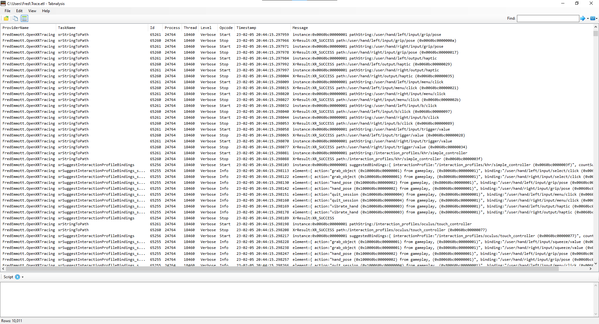

# OpenXR-Tracing

Windows [Trace Logging] ([ETW]) as an OpenXR API layer.

## Why?

While the OpenXR SDK source does include a dumping layer:

- OpenXR-Tracing produces ETL files; tools for ETL files like Tabnalysis and Windows Performance Analyzer are designed to deal with extremely large amounts of structured data, and work much better than browsers for this
- OpenXR-Tracing produces more detailed information, such as:
  - both string and handles are shown for `XrPath`, `XrAction`, and `XrActionSet`
  - arrays are walked, e.g. composition layers, subaction paths

On the other hand, the layer included with the OpenXR SDK source has some advantages:

- OpenXR-Tracing uses Windows-specific features, so can not be used on other platforms
- OpenXR-Tracing currently will not handle invalid structs well, and may crash

## Prebuilt binaries

Prebuilt binaries are available in [the latest release](https://github.com/fredemmott/OpenXR-Tracing/releases/latest).

You may need to install the latest Microsoft C++ runtime libraries:

- x86: https://aka.ms/vs/17/release/vc_redist.x86.exe
- x64: https://aka.ms/vs/17/release/vc_redist.x64.exe

## Dependencies

- **Python**: installing from the MS store or `winget` should be fine.

  Python is used to generate most of the code of this project, based on the OpenXR specification; the API specification is an XML file, and the OpenXR SDK source includes Python classes for processing this XML file.

- **Visual Studio 2022, C++ compilers, and clang tools**

## Building

1. Open "x64 Native Tools Command Prompt for VS 2022" (or "x86 Native Tools ...."); **DO NOT** use "Developer Powershell for VS xxxx" or "Developer Command Prompt for VS xxxx"
2. `cd /path/to/your/checkout`
3. Fetch submodules: `git submodule update --init`
4. Run `pwsh ./build.ps1`

`build.ps1` supports two flags:
- `-Clang`: use `clang-cl.exe` instead of `cl.exe`
- `-SkipCodegen`: don't create or update the `gen/` directory
- `-SkipCompile`: create or update the `gen/` directory, but don't build

## Usage

Two API layers are generated:
- `XR_APILAYER_FREDEMMOTT_OXRTracing`
- `XR_APILAYER_FREDEMMOTT_OXRTracing_Alternate`

These are identical, except for the name, which is included in the trace data; this allows tracing both sides of another OpenXR API layer.

Each of these layers has its' own DLL and json file in `out\` after building; uou may want to disable the layer when you're not actively using this layer - it has not been optimized for performance.

### Enabling the layers

You can manually add the .json file to the registry like any other layer, or use `install.ps1` and `wrap.ps1` as administrator. You might find [list-openxr-layers] handy.

With administrator powershell:

    install.ps1 -Mode First

Or, last:

    install.ps1 -Mode Last

You can also install the layer immediately `Before` or `After` another layer:

    install.ps1 -Mode Before -RelativeTo C:\Path\To\Other\APILayer.json

You can `Enable`, `Disable`, or `Remove` the layer:

    install.ps1 -Mode Disable

You can install both layers, on either side of another layer:

    wrap.ps1 -RelativeTo C:\Path\To\Other\APILayer.json

To change the secondary layer (or any other API layer):

    install.ps1 -Mode Disable -LayerPath (Get-Item out\APILayer_Alternate.json).FullName

### Collecting trace data

To start collecting data, as administrator:

    wpr -start OXRTracing.wprp -filemode

To finish collecting data and write an ETL file:

    wpr -stop MyTraceFile.etl

If you're looking for an event log rather than profiling information, I recommend [Tabnalysis].

## License

This project is [MIT licensed](LICENSE)

[list-openxr-layers]: https://github.com/fredemmott/list-openxr-layers/releases
[Trace Logging]: https://learn.microsoft.com/en-us/windows/win32/tracelogging/trace-logging-portal
[ETW]: https://learn.microsoft.com/en-us/windows/win32/etw/about-event-tracing
[Tabnalysis]: https://apps.microsoft.com/store/detail/tabnalysis/9NQLK2M4RP4J

